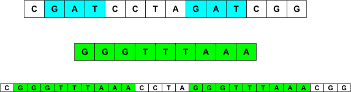

# P4 DNA LinkStrand
Compsci 201 Fall 2020

## Outline
- [Background and Introduction](#project-background-and-introduction)
- [Part 1: Part 1: Running DNABenchmark, Profiling, Analysis](#part-1-running-dnabenchmark-profiling-analysis)
- [Part 2: Programming](#part-2-programming)
- [Part 3: Analysis and More Benchmarking](#part-3-analysis-and-more-benchmarking)
- [Submitting, Reflect, and Grading](#submitting-reflect-and-grading)

## Project Background and Introduction

In this assignment you'll experiment with different implementations of a simulated [restriction enzyme cutting](https://en.wikipedia.org/wiki/Restriction_enzyme) (or cleaving) of a DNA molecule. In this context, you will study the application of the linked list data structure toward a real world problem.

<details>
<summary>Background</summary>

This background is interesting, but not really needed to do the assignment. There are some good stories here, but if you want to get to the assignment, you can skip this. [Three scientists shared the Nobel Prize](http://nobelprize.org/nobel_prizes/medicine/laureates/1978/press.html) in 1978 for the discovery of restriction enzymes. They're also an essential part of the process called [PCR polymerase chain reaction](http://en.wikipedia.org/wiki/Polymerase_chain_reaction) which is one of the most significant discoveries/inventions in chemistry and for which Kary Mullis won the Nobel Prize in 1993.

Kary Mullis, the inventor of PCR, is an interesting character. To see more about him see this archived copy of a [1992 interview in Omni Magazine](http://web.archive.org/web/20010121194200/http://omnimag.com/archives/interviews/mullis.html) or his [personal website](http://karymullis.com/) which includes information about his autobiography Dancing Naked in the Mind Field, though you can read this free [Nobel autobiography](https://www.nobelprize.org/prizes/chemistry/1993/mullis/biographical/) as well.

The simulation is a simplification of the chemical process, but provides an example of the utility of linked lists in implementing a data structure. The linked list code you'll write and reason about is an example of a chunk list. 
</details>

### Overview: What to Do

Here's a high-level view of the assignment. This is enough information to know what to do, but not necessarily how to do it. For details, you can refer to sections later in this write-up. You can, could, perhaps even should? also work to figure some things out on your own, referring to the later sections to clear up misunderstandings, for example.

You'll be developing `LinkStrand`, an implementation of the `IDnaStrand` interface that uses an internal linked list to model recombinant DNA. You'll need to run a benchmarking program, `DNABenchmark`, before you start writing code as part of profiling two implementations of the `IDnaStrand` interface that you're given and to which you'll compare the `LinkStrand` class you develop. You'll re-run the benchmark program after developing `LinkStrand` and after it passes all the JUnit tests you're given. You'll also need to develop an additional benchmarking program as part of answering analysis questions.

Here are the major parts of the assignment.
1. In [Part 1](#part-1-running-dnabenchmark-profiling-analysis) you will run the benchmarking program before you write code as part of answering questions in the analysis section.
2. In [Part 2](#part-2-programming) You will create a new class `LinkStrand` that implements the `IDnaStrand` interface. You'll create an inner `Node` class with instance variables `myFirst` and `myLast` and you'll then implement all the methods in the `IDnaStrand` interface, testing them using supplied JUnit tests. There are two constructors and several methods. You should read the comments in the `IDnaStrand` interface and use the existing implementations `StringStrand` and `StringBuilderStrand` to understand what these methods do. IntelliJ will fill in stub methods when you create the class and edit it so that it implements `IDnaStrand`; you'll implement them using a singly-linked list as detailed below.
3. In [Part 3](#part-3-analysis-and-more-benchmarking) you'll modify a class `CodonProfiler` to be more efficient and implement a new benchmarking class `AnalysisDNA` to help answer analysis questions.

### Git, Partners, and Submitting for P4

If you're working in a group, one person will fork-and-clone from the GitLab repo. That person will add the other person/partner as a collaborator on the project. Details are provided below. For full information, see the documentation here: [https://docs.gitlab.com/ee/user/project/members/](https://docs.gitlab.com/ee/user/project/members/). 

<details>
<summary>Details on Git for P4</summary>
Git With Partners 
Choose Settings>Members>Invite Members. Then use the autocomplete feature to invite your partner to the project. Both of you can clone and push to this project. 

1. First, one person should create the GitLab repository then add the partner as a maintainer to the project.
2. Both students should clone the same repository and import it into IntelliJ.  
3. After both students have cloned and imported, one person should create the `LinkStrand.java` class and add a comment to it with their name in a comment at the start of the file. Commit and push this change. 
4. The other partner will then use the command line and issue a git pull request. Simply use the command-line (in the right folder/directory) and type:
```bash
git pull
```
5. Reload `LinkStrand` in your IntelliJ project. You should see the modified `LinkStrand.java` file with a new comment. Add your name in a comment, then commit and push. The other person will need to issue a git pull to get that file.

As long as partners are modifying different files, this process works seamlessly. Modifying the same file can lead to issues in resolving conflicts. Git will deal with this with your help, but it's better to take turns in working on the same file, or to work on different files within the project. 

Fork, clone, and import the cloned project from the file system. 

Use this URL from the course GitLab site: [https://coursework.cs.duke.edu/201fall20/p4-dnalinked-fall20](https://coursework.cs.duke.edu/201fall20/p4-dnalinked-fall20). Be sure to fork first (see screen shot). Then Clone using the SSH URL after using a terminal window to cd into your IntelliJ workspace. 


When you make a series of changes you want to 'save', you'll push those changes to your GitLab repository. You should do this after major changes, certainly every hour or so of coding. You'll need to use the standard Git sequence to commit and push to GitHub:

```bash 
git add .
git commit -m 'a short description of your commit here'
git push
```

Partners should get used to using git pull before programming!

</details>


## Part 1: Running DNABenchmark, Profiling, Analysis

You can do this Part 1 without writing any linked list code. We strongly suggest you do this (with your partner) before starting on the linked list, Part 2 of the assignment.

### Benchmark Times for String and StringBuilder

You'll need to run the `DNABenchmark` class twice, once for each implementation of the `IDnaStrand` interface: `StringStrand` and `StringBuilderStrand`.  You change the runs by changing the value of the static instance variable `strandType` at the top of the class file. You should copy/paste the output that's generated by running the benchmark program using the large ecoli.txt file that's in the data folder you get when the project is cloned. The benchmark runs until memory is exhausted.  Results are shown in the [Part 3](#part-3-analysis-and-more-benchmarking) section from an instructor/TA laptop. You should generate your own results from the machine you run the benchmark code on. The `StringStrand` class will take a very long time to run!

Your results will not be the same as those shown here, and you may run out of memory with more or fewer experiments. But you should copy/paste the results of your runs into the document you create for the analysis section -- using a shared (Google/Office 365) document with your partner is a good idea.

Note that the benchmark code runs two experiments to average the results. So the time for `StringStrand` in real time is much longer than what's reported as the average (at least double, then more).

### Modify and Run AnalysisDNA

You're given a class `AnalysisDNA` that runs one benchmark test. Modify it based on the comments in the main method so that a splicing experiment is run with a strand of DNA whose number of breaks (occurrences of restriction enzyme) increases linearly, so that 10 runs are made and timed. In the previous `DNABenchmark`, the size of the splicee changes. In this program the size is a constant, and the number of breaks changes. This will allow you to answer two questions about the runtime of `StringStrand` as being O(b<sup>2</sup>S) and `StringBuilderStrand` being O(bs) as explained in the analysis section. You should generate runs for each of these strand types as explained in the analysis section.


## Part 2: Programming

### LinkStrand implements IDnaStrand

You will create a new class named `LinkStrand`. This class must implement the `IDnaStrand` interface as explained in some detail below. You should allow IntelliJ to fill in all the methods needed to implement the interface with stub interfaces, e.g., that return null or zero for example -- see below for how to get IntelliJ to do this.  Then you'll implement and test the methods as described here and in the section that follows on how the class works. Here's the header for the class that you'll implement:

```java 
public class LinkStrand implements IDnaStrand
```

IntelliJ will indicate the class won't compile with a red squiggly line under the class declaration. If you choose ALT-return or OPTION-return you'll see the menu to the right pop up. Use the default unimplemented methods that are checked, press OK, and you'll have stub methods to implement.
 
You'll implement two constructors as described below. The constructors and methods don't need to be implemented in the order shown, but the simpler methods are listed first. These methods are tested in the `TestStrand` class except for `charAt` which is tested in the `TestIterator` class. In descriptions below `N` is the number of nucleotides/basepairs/characters in a strand.

You should test each method as you implement it using the TestStrand JUnit test class. You'll need to change the type of strand returned in that JUnit class method `getNewStrand` to test your class. It's unlikely that any tests will work until you've implemented `LinkStrand.toString()`.

You should run the JUnit tests in both `TestStrand` and `TestIterator`. Verify that these work for `StringStrand` and `StringBuilderStrand` and then use these classes to test your `LinkStrand` implementation. 


#### 1. `LinkStrand` State, Constructors and `initialize` Method
Implement two constructors: one with no parameters (the default constructor) and one with a `String` parameter. The constructors work by calling the required initialize method, see `StringStrand` for an example. Implement the initialize method that initializes the `LinkStrand` object with a `String`.

<details>
<summary>Details on LinkStrand State, Constructors and initialize Method</summary>

You should start with the following definitions for a private inner class and instance variables to use a linked-list internally as part of the LinkStrand class. Note that all are private.

```java
private class Node {
     String info;
     Node next;

     public Node(String s, Node n) {
          info = s;
          next = n;
     }
}

private Node myFirst, myLast;
private long mySize;
private int myAppends;
```

**All constructors and methods must maintain the following class invariants:**
1. `myFirst` references the first node in a linked list of nodes.
2. `myLast` references the last node in a linked list of nodes.
3. `mySize` represents the total number of characters stored in all nodes together.
4. `myAppends` is the number of times that the append method has been called. It would be useful to think of this as one less than the number of nodes in the linked list.

Initially, when the `LinkStrand("cgatt...")` constructor is called  (though the `String` parameter can be any string) there will be a single `Node` in the linked list that represents the DNA strand `"cgatt…"`. (The only way to have more than one node in a `LinkStrand` internal linked-list is by calling `.append`.)


As described above, you'll create two constructors. The string constructor should consist of one call to initialize which establishes the class invariant with a single node representing the entire strand of DNA as illustrated. The no-argument constructor, also called the default constructor, should have one line: `this("")` which calls the other constructor with a String parameter of `""`. 

The `initialize` method will maintain the class invariants when it's called. There will be a single node created after `initialize` is called.

</details>

#### 2. Implementing the `getInstance` and `size` Methods
Implement the `getInstance` method that works similarly to what you see in `StringStrand` and `StringBuilder` strand. This must return a `LinkStrand` object. Implement `size`. This should be a single line and must run in `O(1)` time.

<details>
<summary>Details on Implementing the getInstance and size Methods</summary>

The `getInstance` method works similarly to what you see in `StringStrand` and `StringBuilder` strand. This must return a `LinkStrand` object. 

The `size` method returns the total number of string characters in the `LinkStrand`. 

</details>

#### 3. Implementing the `append` and `getAppendCount` Methods 
Implement `append` which creates one new node and updates instance variables to maintain class invariants as described in the details below. Implement `getAppendCount`. This should be a single line and must run in `O(1)` time.

<details>
<summary>Details on Implementing the append and getAppendCount Methods</summary>

The `append` method should add one new node to the end of the internal linked list and update state to maintain the invariant. For example, suppose that these two statements are both executed:

```java
LinkStrand dna = new LinkStrand("cgatt");
dna.append("aattcc");
```


The internal linked list maintained by `LinkStrand` after the first call is diagrammed above. After the call to append we have the following picture:

Note that maintaining the class invariant after this call to append would require:
1. `myFirst` doesn't change
2. `myLast` changes to point to the new node added
3. `mySize` is incremented by six
4. `myAppends` is incremented by one (because a new node is added).

Note that `.append` returns an `IDnaStrand` object. This is the object that was just modified/appended to. However, the method append does not create a new `IDnaStrand` object. The `.append` method is a mutator -- it changes the internal state of the `IDnaStrand` object on which it's invoked, and then returns this `LinkStrand` object itself. Look carefully at both `StringStrand` and `StringBuilderStand` strand to see what to return.

Note that after implementing `append`, the method `getAppendCount` should return the correct result, the value of instance variable `myAppends` that's maintained by the class invariants and initialized/updated in `initialize` and `append`.
</details>


#### 4. Implementing the `toString` Method
Implement `toString`. This returns the `String` representation of the `LinkStrand` by looping over nodes and appending their values to a `StringBuilder` object. The method should run in `O(N)` time.

<details>
<summary>Details on Implementing the toString Method</summary>
The `toString` method returns the `String` representation of the entire DNA strand. Conceptually this is a concatenation of the `String` stored in each node.

This method should use a standard `while` loop to visit each node in the internal linked list. The method creates and updates a single `StringBuilder` object by appending each `node.info` field to a `StringBuilder` object that's initially empty. The final return from `LinkStrand.toString` will simply be returning the result of calling `.toString()` on the `StringBuilder` object. See the `DNABenchmark.dnaFromScanner` implementation for guidance on the `StringBuilder` strand class.

For more guidance on `StringBuilder`, see the Java Documentation [here](https://docs.oracle.com/en/java/javase/14/docs/api/java.base/java/lang/StringBuilder.html). 

You should be able to test all the methods implemented to this point using the class `TestStrand`. The testing methods in `TestStrand` rely on `.toString` being correct, so after implementing `.toString` you may find errors in your other methods as a result of testing.

</details>

#### 5. Implementing the `reverse` Method
Implement `reverse` to return a new `LinkStrand` object that's the reverse of the object on which it's called. This method is not a mutator, it creates a new `LinkStrand`.

<details>
<summary>Details on Implementing the reverse Method</summary>
This method creates a new `LinkStrand` object that is the reverse of the object on which it's called. The reverse of `"cgatccgg"` is `"ggcctagc"`. This method returns a new strand; it does not alter the strand on which it's called, i.e., it's not a mutator. 

Note: you must create `N` new nodes in reversing a `LinkStrand` object with `N` nodes. If you do not, you are likely mutating/changing the `LinkStrand` being reversed.

You'll need to reverse the linked list, and reverse each string in each node of the linked list. Specifically, the reversed `LinkStrand` should have the same number of nodes as the original `LinkStrand`, but in reverse order; each internal node should also contain the reversed `String` of the corresponding node in the original `LinkStrand`.

To reverse a `String` use a `StringBuilder` appropriately --- see `StringStrand.reverse` for details on using the `StringBuilder.reverse` method. 

Note that in creating a new linked list that's the reverse of the list of nodes being traversed it's easiest to simply add a new node to the front of the reversed list being constructed. So in reversing a->b->c->d and traversing in order a,b,c,d, your code would have created the list c->b->a after traversing the first three nodes: a,b,c. When reaching the next or 'd' node your code adds 'd' to the front of this list creating d->c->b->a.
</details>

#### Implementing the `charAt` method
Implement `charAt` which returns the character at a specific index. This method requires new instance variables to meet performance characteristics.
<details>
<summary>Details on Implementing the charAt method</summary>
This method returns the character at the specified index if that's a valid index, and throws an `IndexOutOfBoundsException` otherwise. A naive implementation of this method would start at the beginning of the linked list, the node referenced by `myFirst` and count characters until the index-th character is found. 

For full credit (and to pass the timing tests in `TestIterator`) you'll need to maintain state so that after a call of `charAt(k)` the call of `charAt(k+1)` is an `O(1)` operation. This will make the loop below `O(N)` for an `N` character strand.

##### Basic, Correct but Inefficient Implementation of charAt
First we'll show an inefficient implementation of the charAt method --- a method to find a character at a specific index in a linked list of strings. Your code will need to traverse the linked list counting characters. The code below illustrates how to do this. It doesn't check to see if parameter index is valid, but it passes the JUnit tests for correctness.

```java
public int charAt(int index) {
     int count = 0;
	int dex = 0;
	Node list = myFirst;
	while (count != index) {
		count++;
		dex++;
		if (dex >= list.info.length()) {
			dex = 0;
			list = list.next;
		}
	}
     return list.info.charAt(dex);
}
```

This code will pass correctness tests, e.g., in `TestIterator`. However, it's not efficient since it starts at the beginning of the linked list for each call. You should be sure you understand how local variables `count` and `dex` are used in the code above before trying to make the code more efficient for a sequence of calls as explained in the next section.

##### Efficient Implementation of charAt
You should create instance variables in the class `LinkStrand` so that after a call of `charAt(k)`, calling `charAt(k+1)` is an `O(1)` operation. 

You can see in the code above that three values are used, these correspond to the three variables shown above: 
- the current node in the iteration (`list`), 
- the current index in that node (`dex`),
- the overall count (`count`). 

You should create and initialize three corresponding instance variables: one for the current node in a sequence of calls of `charAt`, one for the current index into that node, and one for the overall count. You'll need to initialize these instance variables when a strand is created, e.g., in method `initialize`.  You'll use these instance variables on each call to `charAt`, and you'll update them similarly to how the local variables are updated -- to save the current “progress” so that on a subsequent call to `charAt` it might be possible to continue from the last call and access the next character in a node, for example, by simply incrementing the index into that node. Of course this might require going to the next node if the current node is "out" of characters just as is done in the code shown above.

Use these three instance variables and update them appropriately in `charAt`:
- `myIndex` is the value of the parameter in the last call to `charAt`. This means that if a call to `s.charAt(100)` is followed by `s.charAt(101)` the value of `myIndex` will be 100 after `s.charAt(100)` executes and 101 after `s.charAt(101)` executes.
- `myLocalIndex` is the value of the index within the string stored in the node last-referenced by `charAt` when the method finishes. For example, suppose a strand consists of three nodes: the first has 60 characters; followed by a node of 30 characters; followed by a node of 40 characters. The call `s.charAt(40)` will mean that `myIndex` is 40 and `myLocalIndex` is also 40 since that's the index within the first node of the list, where the character whose index is 40 is found.  Suppose this is followed by `s.charAt(70).` The character at index 60 of the entire strand will be the character with index zero of the second node -- since the first node holds characters with indexes 0-59 since its info field is a string of 60 characters. The character at index 70 of the entire strand will be the character with index 10 of the second node.


- `myCurrent` is the node of the internal list referenced in the last call to `charAt`. In the example above the value of `myCurrent` would be the first node after the call `s.charAt(40)`, would be the second node after the call `s.charAt(70)` or `s.charAt(89)`, and would be the third node after the call `s.charAt(90)` since the first two nodes only contain a total of 90 characters, with indexes 0 to 89.

In the `TestIterator` code you get with this assignment, there are correctness tests and performance tests for going forward in `O(N)` time as described here.

##### Why do we need charAt to be efficient?
If the `charAt` method is not efficient, the loop below will be `O(N^2)` since the `charAt` method will be `O(k)` to access the kth character.

```java
LinkStrand dna = new LinkStrand(".....");
StringBuilder s = new StringBuilder("");
for(int k=0; k < dna.size(); k++) {
    s.append(dna.charAt(k));
}
```

This `charAt` method is called by the code in the `CharDnaIterator` class. So iterating over an `IDnaStrand` object will ultimately use the `charAt` method as shown in the code below. 

```java
LinkStrand dna = new LinkStrand(".....");
Iterator<Character> iter= dna.iterator();
for(char ch : iter) {
    System.out.print(ch);
}
System.out.println();
```

The `Iterator` object in the code above is constructed as a result of calling the default `IDnaStrand.iterator` method, the body is shown here: 

```java
return new CharDnaIterator(this);
```

Note that the `IDnaStrand` object referenced by this is then stored in the `CharDnaIterator` object being created. 

You only need to implement `charAt`, then all the code described and shown above will work correctly! You will need to initialize the instance variables too.

##### Order of Calls Matters
However, you'll need to write code to deal with calls that aren't "in order". If the call `.charAt(100)` is followed by the call `.charAt(30)` you'll need to start at the beginning of the internal linked list to find the character with index 30. If `.charAt(100)` is followed by `.charAt(350)` you won't start at the first node, but continue with the values stored in the instance variables.

</details>


## Part 3: Analysis and More Benchmarking

You'll need to run the `DNABenchmark` class three times, once for each implementation of the `IDnaStrand` interface: `StringStrand`, `StringBuilderStrand`, and `LinkStrand`. You did the first two runs for [Part 1](#benchmark-analysis), the last after implementing LinkStrand.


### Benchmark results for all Strands
Run `DNABenchmark` with  `strandType` to `"LinkStrand"` after that class has been tested. Note that this takes just seconds to run, and strand/splicee sizes are significantly larger than with the other `IDnaStrand` types. 

Results for all three strand types are shown below as generated in September 2020 on ola's laptop. These are different from results in the past and will be different from results in the future and on your laptop/machine. These are run on the large ecoli.txt file.

<details>
<summary>StringStrand Benchmark Results</summary>

```
dna length = 4,639,221
cutting at enzyme gaattc
-----
Class	                splicee	      recomb	time	appends
-----
StringStrand:	            256	      4,800,471	0.550	1290
StringStrand:	            512	      4,965,591	0.508	1290
StringStrand:	          1,024	      5,295,831	0.570	1290
StringStrand:	          2,048	      5,956,311	0.629	1290
StringStrand:	          4,096	      7,277,271	0.850	1290
StringStrand:	          8,192	      9,919,191	1.161	1290
StringStrand:	         16,384	     15,203,031	1.567	1290
StringStrand:	         32,768	     25,770,711	2.994	1290
StringStrand:	         65,536	     46,906,071	6.398	1290
StringStrand:	        131,072	     89,176,791	11.948	1290
StringStrand:	        262,144	    173,718,231	23.343	1290
StringStrand:	        524,288	    342,801,111	54.330	1290
StringStrand:	      1,048,576	    680,966,871	92.724	1290
Exception in thread "main" java.lang.OutOfMemoryError: Java heap space
	at java.base/jdk.internal.misc.Unsafe.allocateUninitializedArray(Unsafe.java:1387)
	...
	at StringStrand.append(StringStrand.java:70)
	at IDnaStrand.cutAndSplice(IDnaStrand.java:41)
	at DNABenchmark.strandSpliceBenchmark(DNABenchmark.java:67)
	at DNABenchmark.main(DNABenchmark.java:112)
```

</details>

<details>
<summary>StringBuilderStrand Benchmark Results</summary>

```
dna length = 4,639,221
cutting at enzyme gaattc
-----
Class	                splicee	      recomb	time	appends
-----
StringBuilderStrand:	            256	      4,800,471	0.048	1290
StringBuilderStrand:	            512	      4,965,591	0.032	1290
StringBuilderStrand:	          1,024	      5,295,831	0.007	1290
StringBuilderStrand:	          2,048	      5,956,311	0.006	1290
StringBuilderStrand:	          4,096	      7,277,271	0.008	1290
StringBuilderStrand:	          8,192	      9,919,191	0.006	1290
StringBuilderStrand:	         16,384	     15,203,031	0.014	1290
StringBuilderStrand:	         32,768	     25,770,711	0.013	1290
StringBuilderStrand:	         65,536	     46,906,071	0.034	1290
StringBuilderStrand:	        131,072	     89,176,791	0.048	1290
StringBuilderStrand:	        262,144	    173,718,231	0.132	1290
StringBuilderStrand:	        524,288	    342,801,111	0.298	1290
Exception in thread "main" java.lang.OutOfMemoryError: Java heap space
	at java.base/java.util.Arrays.copyOf(Arrays.java:3536)
	...
	at StringBuilderStrand.append(StringBuilderStrand.java:70)
	at IDnaStrand.cutAndSplice(IDnaStrand.java:41)
	at DNABenchmark.lambda$strandSpliceBenchmark$0(DNABenchmark.java:76)
	at DNABenchmark$$Lambda$197/0x0000000800cac040.run(Unknown Source)
	at java.base/java.lang.Thread.run(Thread.java:832)
	at DNABenchmark.strandSpliceBenchmark(DNABenchmark.java:79)
	at DNABenchmark.main(DNABenchmark.java:112)
```

</details>

<details>
<summary>LinkStrand Benchmark Results</summary>

```
dna length = 4,639,221
cutting at enzyme gaattc
-----
Class	                splicee	      recomb	time	appends
-----
LinkStrand:	            256	      4,800,471	0.031	1290
LinkStrand:	            512	      4,965,591	0.031	1290
LinkStrand:	          1,024	      5,295,831	0.029	1290
LinkStrand:	          2,048	      5,956,311	0.024	1290
LinkStrand:	          4,096	      7,277,271	0.025	1290
LinkStrand:	          8,192	      9,919,191	0.026	1290
LinkStrand:	         16,384	     15,203,031	0.029	1290
LinkStrand:	         32,768	     25,770,711	0.027	1290
LinkStrand:	         65,536	     46,906,071	0.005	1290
LinkStrand:	        131,072	     89,176,791	0.004	1290
LinkStrand:	        262,144	    173,718,231	0.004	1290
LinkStrand:	        524,288	    342,801,111	0.005	1290
LinkStrand:	      1,048,576	    680,966,871	0.006	1290
LinkStrand:	      2,097,152	  1,357,298,391	0.004	1290
LinkStrand:	      4,194,304	  2,709,961,431	0.008	1290
LinkStrand:	      8,388,608	  5,415,287,511	0.006	1290
LinkStrand:	     16,777,216	 10,825,939,671	0.013	1290
LinkStrand:	     33,554,432	 21,647,243,991	0.007	1290
LinkStrand:	     67,108,864	 43,289,852,631	0.006	1290
LinkStrand:	    134,217,728	 86,575,069,911	0.008	1290
LinkStrand:	    268,435,456	173,145,504,471	0.007	1290
LinkStrand:	    536,870,912	346,286,373,591	0.019	1290
LinkStrand:	  1,073,741,824	692,568,111,831	0.047	1290
Exception in thread "main" java.lang.OutOfMemoryError: Java heap space
	at java.base/java.util.Arrays.copyOf(Arrays.java:3536)
	at java.base/java.lang.AbstractStringBuilder.ensureCapacityInternal(AbstractStringBuilder.java:227)
	at java.base/java.lang.AbstractStringBuilder.append(AbstractStringBuilder.java:593)
	at java.base/java.lang.StringBuilder.append(StringBuilder.java:173)
	at DNABenchmark.main(DNABenchmark.java:109)
```
</details>

### Analysis Questions

Complete the program `AnalysisDNA.java` by modifying it as explained [above](#modify-and-run-analysisdna) and in comments in the main method of that program. The purpose of your modifications are to answer the two questions here. **Include your answers in the PDF you submit to the analysis assignment for P4 in Gradescope.**

**Question 1:** are the benchmark timings for `StringStrand` consistent with the explanation below that the time to execute `cutAndSplice` is O(b<sup>2</sup>S)? 

Note that the value of b is half the number of calls to append since each cut (except the first) is modeled by two calls of `append` in the method `cutAndSplice` -- see the code. This means that b<sup>2</sup> will be constant in the benchmark, but S will vary. 

**Question 2:** are the benchmark timings for `StringBuilderStrand` consistent with the explanation below that the time to execute `cutAndSplice` is O(bS)? 

Note that the value of b is half the number of calls to `append` since each cut (except the first) is modeled by two calls of `append` in the method `cutAndSplice` -- see the code. 

**Question 3:** Explain why the time for `LinkStrand` does not change much at all over all the runs in the benchmark program. Explain why you think memory is exhausted at the specific strand size you see in your timings -- as compared to exhaustion for `String` and `StringBuilder`.


### Detailed Explanation of cutAndSplice: Time/Memory Complexity

The method `cutAndSplice` is not a mutator. It starts with a strand of DNA and creates a new strand by finding each and every occurrence of a restriction enzyme like `“gaattc”` and replacing this enzyme by a specified splicee -- another strand of DNA. If `dna` represents the strand `"cgatcctagatcgg"` then the call 

```java
dna.cutAndSplice("gat", "gggtttaaa")
```

would result in returning a new strand of DNA in which each occurrence of the enzyme/strand `"gat"` in the object `dna` is replaced by the splice, `"gggtttaaa"` -- as shown in the diagram below where the original strand is shown first, with the enzyme `"gat"` shaded in blue. A new strand of DNA is created and returned in which each occurrence of the enzyme `"gat"` is replaced by the splicee `"gggtttaaa"` as shown below. This diagram illustrates how `cutAndSplice` works with both `StringStrand` and `StringBuilderStrand`. Each is a strand of 14 characters in which the restriction enzyme `"gat"` occurs twice, is replaced by `"gggtttaaa"`, resulting in creating and returning a new strand that contains 26 characters.



If the original strand has length N, then the new strand has N + b(S-E) characters where b is the number of breaks, or occurrences of the enzyme, S is the length of the splicee and E is the length of the enzyme. In the diagram above we have 14 + 2(9-3) which is 26. If we assume the splicee is large, as it will be when benchmarking, we can ignore E and this becomes N + bS. 

This expression represents the memory used for the last strand created, not the total memory used (see below). The runtime will depend on how long it takes to concatenate two character-sequences. Concatenating two String objects requires creating a new String, so the time to concatenate two strings of length A and B is A + B. For `StringBuilder` objects, the time to append a String of length B to a `StringBuilder` of length A is just B, since the `StringBuilder` is altered so it has length A + B by simply appending B characters. If we append a character sequence of length S and we do this b times, then if we start with an empty strand (which isn't the case, because the original strand of DNA is added to via the `cutAndSplice` method) then we'd have the following sequence of b string concatenations using `StringStrand`.

S

S + S

S + S + S

…

S + … + S (b times) for the last concatenation

This is (1 + 2 + .. + b)S which is O(b<sup>2</sup>S). Note that if we use `StringBuilderStrand` objects we'd simply append S a total of b times for an O(bS) runtime for creating the new strand.  Of course, searching for the b breaks requires O(N) time for an N-character strand.

#### LinkStrand Time/Memory

For the same cut/splice diagrammed above, the `LinkStrand` result is diagrammed below.


Each time the original strand, a single string, is cut/spliced a new node is created. The nodes pointing to the splicee can point to the same splicee as shown in the diagram for the second and fourth nodes. These represent the first and second occurrences of `"gat"`, respectively.


## Submitting, Reflect, and Grading 

### Submitting 

You'll submit the code to Gradescope after pushing your program to GitLab. This is a partner/team project in Gradescope, so one person will be able to add the other as partner if you're working together. Only one person a group submits, not both.

Refer to [this document](https://docs.google.com/document/d/1KMIl3lPQYDpE3ZngFeJCiMH1gIk1y82HkfaUAGe7Fso/edit?usp=sharing) for submitting to Gradescope with a partner. 


### Reflect 

You can access the reflect form here [http://bit.ly/201fall20-p4-dna-reflect](http://bit.ly/201fall20-p4-dna-reflect).

You should NOT complete the reflect form until you're done with all  of the coding portion of the assignment. Since you may uncover bugs from the autograder, you should wait until you've completed debugging and coding before completing the reflect form. EACH person in a group should submit a reflect form, NOT one per group.


### Grading


| Points | Grading Criteria |
| ------ | ------ |
| 16 | Code for LinkStrand. This includes 4 for correct and efficient implementation of .charAt method, as well as 2 for API consistency. |
| 11 | Analysis code and questions answered. UTAs will grade and comment on this.  |
| 3 | Reflect form |

We will map total points you earn to scores as follows. For example, 25 is an A- and 30 is an A+.
- 25-30:  A
- 19-24:  B
- 13-18:  C
- 8-12:  D


